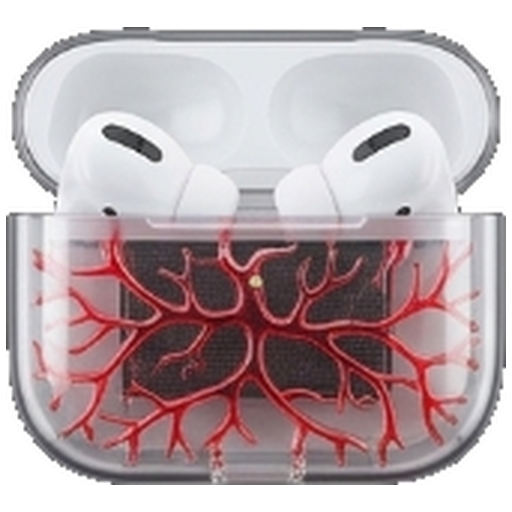

  

<h1 align="center">DeskPods</h1>

  <b>Заряд AirPods на Windows — так же, как на iPhone.</b> 
  Открыл кейс — появилась карточка с зарядом левого, правого наушника и кейса. Всё.

  
  
  
  

  <a href="https://github.com/Stasieps/DeskPods/releases/latest/download/DeskPods_Setup.exe"><b>⬇️ Скачать DeskPods для Windows</b></a>
  &nbsp;·&nbsp;
  <a href="README.md">English</a>
  &nbsp;·&nbsp;
  <a href="README.uk.md">Українською</a>

---

## Зачем я это сделал

Я почти весь день сижу за компом в AirPods, и мне всегда было важно знать
одну простую вещь: **сколько ещё осталось заряда?**

Windows этого нормально не показывает. Поэтому я купил несколько платных программ,
которые обещали это делать. Свою единственную задачу они не выполняли: карточка не
появлялась, когда открываешь кейс, цифры были устаревшие, или окно просто висело на
экране, хотя наушники уже давно в ушах.

Поэтому я сделал свою программу — которая делает одну вещь, но делает её нормально.

## Что умеет

| | |
|---|---|
| 🎧 **Карточка при открытии кейса** | Заряд левого, правого наушника и кейса — в углу экрана. Закрыл крышку — карточка исчезла. |
| 🔋 **Заряд в трее** | Маленькая иконка кейса возле часов. Меняет цвет, когда заряд низкий или AirPods пропали. |
| 🔔 **Одно предупреждение, а не десять** | Когда наушник разряжается, ты получаешь одно напоминание за разряд. Порог выбираешь сам (10–50 %). |
| 👂 **Не мешает** | Наушники в ушах не держат карточку на экране. Никаких больших окон поверх рабочего стола. |
| ⌨️ **Горячая клавиша** | `Ctrl` + `Alt` + `P` — и карточка перед тобой. Комбинацию можно поменять. |
| 🎨 **8 стилей** | Выбери вид под свой сетап — от бумажного E-Ink до Neon. |
| 🌍 **Русский, Українська, English** | Язык переключается в Настройках. |
| 🚀 **Запуск вместе с Windows** | Тихо сидит в трее и готова ещё до того, как ты наденешь наушники. |

## Приватность

- **Без аккаунта, без облака, без рекламы, без слежки.** Ничего не уходит с твоего ПК, кроме проверки обновлений на GitHub (отключается в настройках).
- DeskPods только *слушает* Bluetooth-сигнал, который AirPods и так рассылают для
  устройств Apple рядом. Программа не подключается к наушникам и ничего в них не меняет.
- Если отправляешь отчёт об ошибке, в логе нет сырых радио-данных и твоих настроек.

## Установка

1. **[Скачай `DeskPods_Setup.exe`](https://github.com/Stasieps/DeskPods/releases/latest/download/DeskPods_Setup.exe)**
2. Запусти. Права администратора не нужны. Новая версия ставится поверх старой, настройки сохраняются.
3. Открой кейс AirPods возле компа — карточка появится.

> **Windows пишет «Windows protected your PC»?**
> Это нормально для маленьких бесплатных программ без цифровой подписи
> (сертификат стоит несколько сотен долларов в год). Нажми **More info → Run anyway**
> («Подробнее → Выполнить в любом случае»).

Не хочешь ничего устанавливать? Возьми **portable ZIP** на
[странице релизов](https://github.com/Stasieps/DeskPods/releases/latest), распакуй и запусти `PodsView.exe`.

### Что нужно

- Windows 10 (версия 2004 или новее) или Windows 11, 64-бит
- Комп с Bluetooth
- AirPods хотя бы раз подключены к этому ПК (Параметры Windows → Bluetooth и устройства)

## Какие наушники поддерживаются

| Карточка + заряд | Только заряд |
|---|---|
| AirPods (1, 2, 3 поколения) | AirPods 4 (ANC) |
| AirPods Pro (1 и 2 поколения) | AirPods Pro 2 (USB-C) |
| | AirPods Max, AirPods Max (USB-C) |
| | Модели Beats и Powerbeats |

«Только заряд» значит, что DeskPods их распознаёт и показывает заряд, но карточка при
открытии кейса выключена, пока её не проверили именно на таком железе.
Есть такая модель? [Отчёт с логом](#что-то-не-работает) очень поможет.

## Частые вопросы

**Почему показывает 55 %, а не 57 %?**
AirPods передают заряд шагами по 10 %. Любая программа на Windows получает те же
цифры — DeskPods показывает середину шага, а не делает вид, что знает точнее.

**Карточка не появилась с первого раза.**
Проверь, что AirPods подключены к этому ПК и Bluetooth включён. Если всё равно нет — смотри ниже.

**Программа не садит батарею наушников или ноутбука?**
Нет. Она только слушает сигнал, который AirPods и так передают.

## Что-то не работает?

1. Сразу после проблемы открой DeskPods → **Настройки → Диагностика → Экспорт логов**.
2. [Создай issue](https://github.com/Stasieps/DeskPods/issues/new/choose), опиши, что случилось, и прикрепи файл.

## Поддержать проект

DeskPods бесплатная и такой останется. Если она спасает тебя от «а сколько там
заряда?», можешь купить мне пивко 🍺 — кнопка есть в **Настройки → О программе**,
или на [ko-fi.com/deskpods](https://ko-fi.com/deskpods).

## Для разработчиков

DeskPods — нативное приложение на .NET 8 WPF. Чтобы собрать из исходников, запусти `START.cmd`
и выбери **1** (если нужно, пункт **5** сам поставит .NET 8 SDK).
Тесты: `tests/PodsView.ParserSmoke`, `tests/PodsView.UiSmoke` и Python-проверки в
`tests/portable`. Каждую ветку проверяет CI. Релиз собирается автоматически, когда
пушишь тег `vX.Y.Z`, совпадающий с `VERSION`.
Что менялось в каждой версии: [CHANGELOG.md](CHANGELOG.md).

---

DeskPods — независимый проект, не связан с Apple Inc. и не одобрен ею.
AirPods и Beats — товарные знаки Apple Inc. Лицензия MIT.
